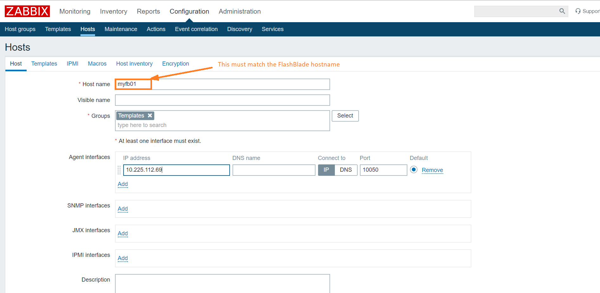

## Zabbix

### Zabbix monitoring extension for Pure Storage Flashblade.

This module is provided in a shape of a Zabbix external checker that retrieves the performance and capacity metrics for the FlashBlade array by using the Zabbix trapper functionality. FlashBlade filesystems and object buckets are dinamically discovered and updated by the means of LLD (low-level discovery).

### Installation

The module is comprised of the Python checker utility and the related XML template file, which contains all the definitions for the items returned by the checker and some basic graphs.

1. Python 3 is required on the Zabbix server, along with the Pure Storage FlashBlade python client library purity_fb and the python Zabbix module py-zabbix. These can be installed by running pip3 with the provided requirements.txt file

    sudo -H pip3 install -r requirements.txt

  Once installed, the Pure Storage FlashBlade python client needs to be patched in order to properly use the connection timeout parameters:

    a. change dir to the local python3 library modules where the purity_fb client is installed
       cd /usr/local/lib/python3.<X>/dist-packages/purity_fb
    b. apply the patch
       patch -b < fb_client.patch
                            
2. On the Zabbix server, copy the pure_fb_check.py script into the Zabbix external script directory (usually /usr/lib/zabbix/externalscripts/)
3. Change the script ownership to the zabbix user and the execution permissions
   chown zabbix:zabbix /usr/lib/zabbix/externalscripts/pure_fb_check.py; chmod ug+x /usr/lib/zabbix/externalscripts/pure_fb_check.py
4. From the Zabbix web UI import the zbx-pure-fb-template.xml
5. Create the log file /var/log/pure_fb_check.log, make it writeable by the owner and assign it to zabbix user.
6. Navigate to the Configuration > Hosts view and add a new host for the FlashBlade array(s) you want to monitor. Select the newly imported FlashBlade template as the base template for the host. Be sure you enter the array IP address as the Agent Interfaces IP address. Wait a couple of minutes for the external checker starts populate the values for the monitored items.

Wait a minute or two and then check the items for the specified array have their values properly populated. 
